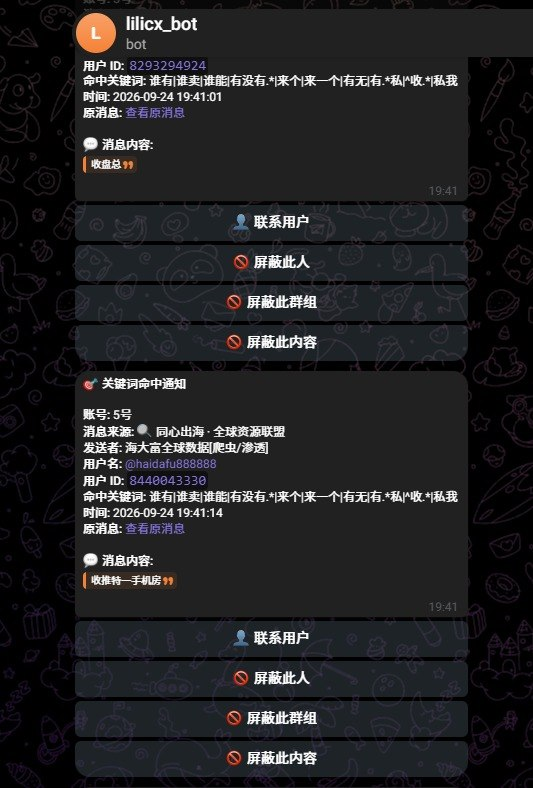

# TelemetryHub

TelemetryHub 是一个面向 Telegram 数据流的本地化运营控制台，用于统一管理账号连接、消息规则、事件记录和通知出口。

项目采用 Web 管理界面，将 Telegram 会话接入、内容筛选、消息留存和自动通知整合到一个服务中。它适合个人自动化、频道运营、团队信息收集以及内部消息流转等场景。

## 主要能力

- 通过 Web 界面管理多个 Telegram 会话
- 支持手机号、验证码和二步验证登录
- 启动、暂停、重连 Telegram 监听任务
- 监听任务异常后自动恢复
- 使用规则筛选消息内容和发送者
- 支持精确匹配、包含匹配、正则表达式和模糊匹配
- 根据用户 ID 或用户名限制消息来源
- 支持不同优先级的包含规则与排除规则
- 将符合条件的消息保存到本地数据库
- 支持分页查询和历史记录检索
- 将事件推送到一个或多个 Telegram Bot
- 在通知中附带原始消息入口
- 支持从通知中快速屏蔽用户、群组或重复内容
- 提供独立的屏蔽对象管理页面
- 默认使用 SQLite，也支持其他 SqlSugar 兼容数据库

## 使用场景

TelemetryHub 可以用于：

- 个人频道和群组的信息汇总
- 多个 Telegram 账号的统一管理
- 关键词驱动的消息提醒
- 运营团队的线索收集
- Telegram 消息的归档与检索
- 自定义消息转发和通知流程
- 内部自动化工作流的数据入口

## 界面预览

### 管理员登录


### 规则配置


### 会话状态


### 消息通知



## 技术概览

- **运行环境**：.NET
- **Telegram 接入**：Telegram API
- **数据库访问**：SqlSugar
- **默认数据库**：SQLite
- **管理方式**：Web 控制台
- **部署方式**：源码运行或 Docker
- **数据存储**：本地持久化目录

## 快速运行

### 配置文件

开发时可以直接修改：

```text
src/appsettings.json
```

也可以创建本地专用配置文件：

```text
src/appsettings.Development.json
```

发布版本可以修改程序目录下的 `appsettings.json`，也可以通过环境变量覆盖配置。

最小配置示例：

```json
{
  "Urls": "http://*:5005",
  "Telegram": {
    "DefaultApiId": 123456,
    "DefaultApiHash": "your_api_hash",
    "SessionsPath": "session"
  },
  "Auth": {
    "AdminUsername": "admin",
    "AdminPassword": "change-me"
  },
  "DbConnection": {
    "DbType": "Sqlite",
    "ConnectionString": "DataSource=telemetryhub.db"
  },
  "Bot": {
    "Enabled": false,
    "Tokens": []
  }
}
```

### 配置注意事项

启动 Telegram 登录前，必须正确填写：

- `Telegram.DefaultApiId`
- `Telegram.DefaultApiHash`

部署到公开环境前，请务必修改：

```text
Auth.AdminPassword
```

以下内容不要提交到公开仓库：

- Telegram API Hash
- Bot Token
- 管理员密码
- Telegram 会话文件
- 生产环境数据库文件

## 从源码启动

```bash
dotnet build src/TelegramMonitor.csproj
dotnet run --project src/TelegramMonitor.csproj
```

启动后访问：

```text
http://localhost:5005/
```

运行离线测试：

```bash
dotnet test TelegramMonitor.slnx
```

系统只会处理监听服务启动之后产生的有效消息。以下内容默认不会触发归档或通知：

- 进程启动前已经存在的历史消息
- 启动前旧消息产生的编辑事件
- 缺少有效时间信息的消息

已有的归档数据不会因为重新启动监听而被清理。

## 首次配置流程

1. 访问 `/` 并登录管理后台。
2. 打开账号控制台 `/dashboard.html`。
3. 输入 Telegram 手机号并发起登录。
4. 提交验证码及二步验证密码。
5. 登录成功后启动对应会话。
6. 前往 `/keywords.html` 创建消息规则。
7. 如果需要通知，进入 `/bot.html` 配置 Bot。
8. 通过通知中的快捷操作屏蔽不需要的来源或内容。
9. 在 `/blacklist.html` 查看和维护已屏蔽对象。
10. 在 `/messages.html` 查询已保存的消息记录。

## 页面路由

| 地址              | 用途                     |
| ----------------- | ------------------------ |
| `/`               | 管理员登录               |
| `/dashboard.html` | Telegram 账号与监听任务  |
| `/keywords.html`  | 消息规则配置             |
| `/messages.html`  | 消息记录查询             |
| `/bot.html`       | Bot 与通知目标管理       |
| `/blacklist.html` | 用户、群组和内容屏蔽管理 |

## 规则系统

规则支持以下匹配模式：

- `Exact`：完整匹配文本
- `Contains`：包含指定文本
- `Regex`：使用正则表达式
- `Fuzzy`：模糊匹配

每条规则可以配置：

- 匹配内容
- 匹配方式
- 发送者用户 ID
- 发送者用户名
- 执行动作
- 规则优先级

目前支持两类动作：

- `Monitor`：命中后归档并进入通知流程
- `Exclude`：命中后排除，不再继续处理

## Bot 通知

通知目标支持以下形式：

- Telegram Chat ID
- `@username`

添加目标时，系统会检查已配置 Bot 是否能够访问目标会话。

对于私聊：

- Bot 必须与目标用户建立过有效会话

对于群组或频道：

- Bot 必须已经加入目标会话
- Bot 在需要发送消息的场景下必须具备相应权限

通知消息可能包含以下快捷操作：

- 联系用户
- 打开原始消息
- 复制发送者 ID
- 屏蔽当前用户
- 屏蔽当前群组或频道
- 屏蔽完全相同的消息内容

原始消息链接的生成规则取决于 Telegram 会话类型：

- 公开频道或公开超级群可以生成消息链接
- 私密频道或私密超级群的链接仅对拥有访问权限的成员有效
- 普通群组和私聊通常不会生成公开消息深链

## 屏蔽管理

系统支持三类屏蔽对象：

1. 用户
2. 群组或频道
3. 完全相同的消息内容

屏蔽记录可以在后台进行：

- 查看
- 搜索
- 筛选
- 停用
- 重新启用
- 删除

内容屏蔽采用完整文本匹配，不等同于关键词包含匹配。

## Docker 部署

```bash
docker run -d \
  --name telemetry-hub \
  --restart unless-stopped \
  -p 5005:5005 \
  -v /root/telemetryhub-data:/data \
  -e Telegram__DefaultApiId=123456 \
  -e Telegram__DefaultApiHash=your_api_hash \
  -e Auth__AdminPassword=change-me \
  -e Bot__Enabled=true \
  -e Bot__Tokens__0=your_bot_token \
  ghcr.io/apomke/telegrammonitor:latest
```

容器中的持久化目录为：

```text
/data
```

以下数据都会保存在该目录中：

- SQLite 数据库
- Telegram 登录会话
- Bot 数据库
- 日志文件
- 数据库辅助文件

生产环境建议使用宿主机绝对路径挂载数据目录，避免因启动位置变化而产生新的空数据库。

## Docker 升级

升级前先确认旧容器实际挂载的数据目录：

```bash
DATA_DIR="$(docker inspect -f '{{range .Mounts}}{{if eq .Destination "/data"}}{{.Source}}{{end}}{{end}}' telemetry-hub)"
test -n "$DATA_DIR" || { echo "未找到 /data 挂载"; exit 1; }

docker pull ghcr.io/apomke/telegrammonitor:latest
docker stop telemetry-hub
cp -a "$DATA_DIR" "${DATA_DIR}.backup-$(date +%Y%m%d-%H%M%S)"
docker rm telemetry-hub
```

随后使用原有配置重新创建容器：

```bash
docker run -d \
  --name telemetry-hub \
  --restart unless-stopped \
  -p 5005:5005 \
  -v "$DATA_DIR:/data" \
  --env-file /root/telemetryhub.env \
  ghcr.io/apomke/telegrammonitor:latest
```

删除旧容器不会删除宿主机中的 `$DATA_DIR`。只要继续挂载原目录，以下内容都会保留：

- Telegram 登录状态
- 消息规则
- 屏蔽记录
- 历史归档
- Bot 配置
- 运行状态

## 容器启动脚本

[`docker-entrypoint.sh`](./docker-entrypoint.sh) 负责在应用启动前准备运行环境和数据目录。

主要工作包括：

- 创建 `/data`
- 持久化 Telegram 会话目录
- 持久化日志目录
- 迁移或链接主数据库
- 持久化 Bot 数据库
- 处理 SQLite 的 `-wal`、`-shm` 和 `-journal` 文件
- 最后启动应用进程

这样可以避免直接挂载整个 `/app`，同时保证镜像更新或容器重建后数据不会丢失。

简单来说：

- `Dockerfile` 用于构建应用镜像
- `docker-entrypoint.sh` 用于初始化容器运行数据
- `/data` 用于保存需要长期保留的内容

## 环境变量

| 环境变量                         | 说明              |
| -------------------------------- | ----------------- |
| `Urls`                           | Web 服务监听地址  |
| `Telegram__DefaultApiId`         | Telegram API ID   |
| `Telegram__DefaultApiHash`       | Telegram API Hash |
| `Telegram__SessionsPath`         | 会话文件目录      |
| `Auth__AdminUsername`            | 后台管理员账号    |
| `Auth__AdminPassword`            | 后台管理员密码    |
| `DbConnection__DbType`           | 数据库类型        |
| `DbConnection__ConnectionString` | 数据库连接字符串  |
| `Bot__Enabled`                   | 是否启用 Bot 通知 |
| `Bot__Tokens__0`                 | 第一个 Bot Token  |
| `Bot__Tokens__1`                 | 第二个 Bot Token  |

## 文档

项目 Wiki 源文件位于：

[wiki/](./wiki/)

## 许可证

本项目遵循仓库中的 [LICENSE](./LICENSE) 文件。
